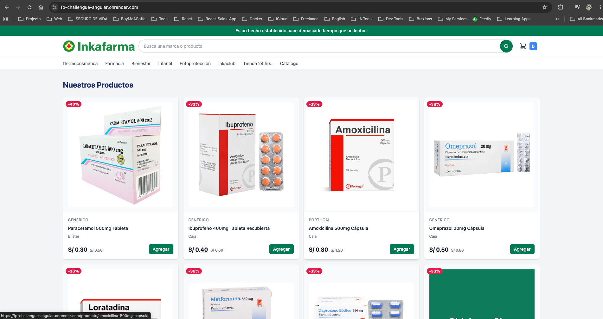
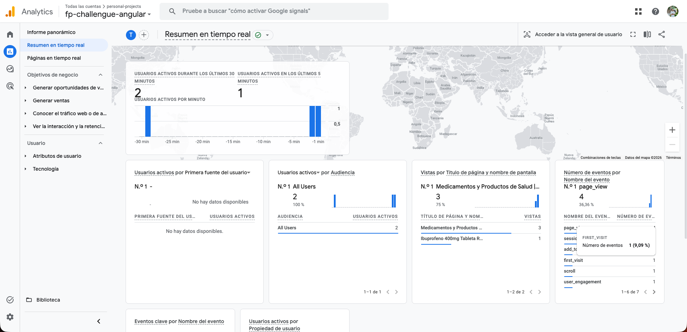
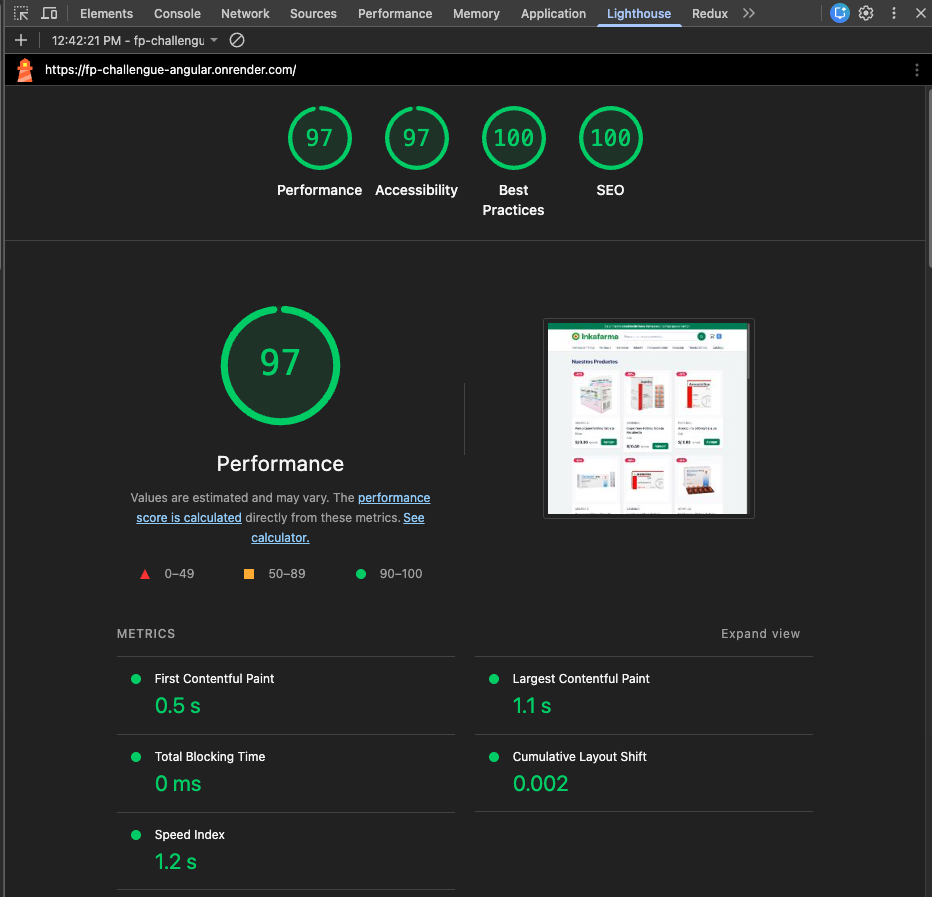
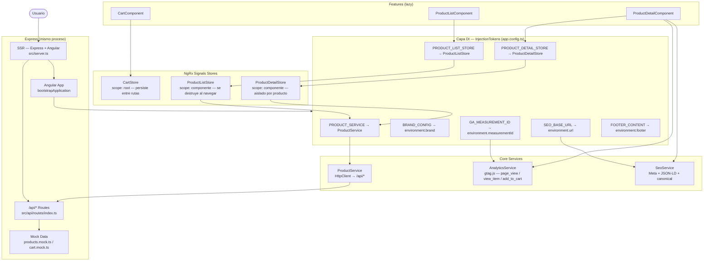

# FP Challenge — Farmacias Peruanas Frontend Senior

Aplicación e-commerce Angular 21 con SSR desarrollada como desafío técnico para Farmacias Peruanas. Implementa listado de productos, página de detalle (PDP) y carrito — con Server-Side Rendering completo, soporte multi-marca, SEO y analítica con Google Analytics.

**Demo en vivo:** https://fp-challengue-angular.onrender.com

> **Nota:** El servidor está desplegado en el plan gratuito de Render. Las instancias gratuitas se duermen tras períodos de inactividad, por lo que la primera carga puede tardar 20–30 segundos mientras el servidor se reactiva (cold start). Este comportamiento es propio de Render, no de la aplicación.

---

## Capturas

### Aplicación en producción



### Google Analytics — tiempo real

La integración con GA4 registra `page_view` en cada navegación de la SPA y eventos de ecommerce (`view_item`, `add_to_cart`) desde los stores. La captura muestra 2 usuarios activos, eventos `page_view`, `session_start`, `add_to_cart` y `first_visit` siendo rastreados en tiempo real.



### Lighthouse — auditoría en producción

Puntuaciones obtenidas sobre la URL de producción en Render: **Performance 97 · Accessibility 100 · Best Practices 97 · SEO 100**. Core Web Vitals: FCP 0.5 s, LCP 1.1 s, TBT 0 ms, CLS 0.002.



---

## Requisitos previos

| Herramienta | Versión mínima |
|-------------|----------------|
| Node.js | 22 LTS |
| pnpm | 9+ |

> El proyecto usa **pnpm** como gestor de paquetes. No usar npm ni yarn — generará conflictos en el lockfile.

---

## Instalación

```bash
# 1. Clonar el repositorio
git clone https://github.com/cbracamonte/fp-challengue-angular.git
cd fp-challenge-angular

# 2. Instalar dependencias
pnpm install

# 3. Iniciar servidor de desarrollo
pnpm start
```

El servidor de desarrollo corre en **http://localhost:4200** con hot module replacement.

---

## Comandos disponibles

| Comando | Descripción |
|---------|-------------|
| `pnpm start` | Servidor de desarrollo en localhost:4200 |
| `pnpm build` | Build de producción con SSR → `dist/` |
| `pnpm test` | Tests unitarios con Vitest (modo watch) |
| `pnpm run serve:ssr:fp-challenge-angular` | Ejecuta el servidor SSR Express ya compilado |

Ejecutar un único archivo de test:
```bash
npx ng test --include="src/app/shared/pipes/currency-format.pipe.spec.ts"
```

---

## Estructura del proyecto

```
src/
├── api/                        # Capa API Express (controllers, routes, services, mock data)
│   ├── controllers/            # Manejadores HTTP
│   ├── routes/                 # Definición de rutas
│   ├── services/               # Lógica de negocio
│   └── data/                   # Datos mock (productos, carrito)
├── app/
│   ├── core/                   # Concerns transversales
│   │   ├── services/           # AnalyticsService, SeoService, ProductService
│   │   ├── state/              # CartStore (NgRx Signals, scope raíz)
│   │   └── tokens/             # InjectionTokens para cada dependencia externa
│   ├── features/               # Features con carga lazy
│   │   ├── cart/               # Página del carrito
│   │   ├── product-detail/     # PDP: galería, info, tabs, productos relacionados
│   │   └── product-list/       # Grilla de productos
│   ├── layout/                 # Componentes shell (header, footer, main-layout)
│   └── shared/                 # Componentes, pipes, modelos y constantes reutilizables
├── environments/               # Configuraciones de entorno por marca
└── styles/
    └── tokens/                 # Design tokens SCSS en capas
        ├── _primitives.scss    # Valores crudos (colores, espaciado)
        ├── _semantic.scss      # Tokens con propósito (--color-primary)
        └── _theme.scss         # Variantes por tema/marca
```

### Alias de paths

```typescript
@core/*     → src/app/core/*
@shared/*   → src/app/shared/*
@features/* → src/app/features/*
@layout/*   → src/app/layout/*
@api/*      → src/api/*
```

Siempre importar mediante alias — nunca con paths relativos `../../`.

---

## Decisiones de arquitectura

### Diagrama de arquitectura



### Angular 21: componentes standalone + signals

Todos los componentes son standalone (sin NgModules). El estado se gestiona exclusivamente con Angular signals y `computed()` para valores derivados — sin estado mutable, sin llamadas a `mutate()`.

### NgRx Signals Store

Tres stores con estrategias de scope distintas:

| Store | Scope | Motivo |
|-------|-------|--------|
| `CartStore` | Raíz (`providedIn: 'root'`) | El carrito persiste entre navegaciones |
| `ProductListStore` | Scope de componente (`withHooks`) | Se recarga en cada visita al listado |
| `ProductDetailStore` | Scope de componente (`withHooks`) | Aislado por producto |

Los stores con scope de componente se destruyen al navegar. Asi evitamos datos desactualizados.
### Inversión de dependencias con InjectionTokens

Cada dependencia externa se inyecta mediante un `InjectionToken` tipado. Ningún componente importa una implementación concreta directamente:

```typescript
// core/tokens/product.ts
export const PRODUCT_SERVICE = new InjectionToken<IProductService>('product.service');

// app.config.ts
{ provide: PRODUCT_SERVICE, useClass: ProductService }

// app.config.server.ts (override para SSR)
{ provide: PRODUCT_SERVICE, useClass: ProductSSRService }
```

Esto permite que el servidor SSR reemplace el `ProductService` basado en HTTP por un `ProductSSRService` directo sin tocar ningún componente de feature.

**Todos los tokens:**

| Token | Tipo | Propósito |
|-------|------|-----------|
| `BRAND_CONFIG` | `BrandConfig` | Nombre de marca, logo, anuncio |
| `FOOTER_CONTENT` | `FooterContent` | Links y columnas del footer |
| `PRODUCT_SERVICE` | `IProductService` | HTTP vs. API directa |
| `SEO_BASE_URL` | `string` | Base para URLs canónicas |
| `GA_MEASUREMENT_ID` | `string` | ID de medición GA4 |
| `PRODUCT_LIST_STORE` | `IProductListStore` | Interfaz del store del listado |
| `PRODUCT_DETAIL_STORE` | `IProductDetailStore` | Interfaz del store del detalle |

### Configuración SSR dividida

Dos objetos `ApplicationConfig` separados evitan que APIs exclusivas del browser rompan en el servidor:

- `app.config.ts` — providers del browser (router, HTTP con `withFetch()`, hidratación)
- `app.config.server.ts` — fusiona config del browser + `provideServerRendering()` + overrides SSR

### Estilos: Tailwind CSS v4 + tokens SCSS en capas

Los design tokens siguen una cascada de tres niveles:

1. `_primitives.scss` — valores crudos (`--green-500: #007A52`)
2. `_semantic.scss` — mapeo por propósito (`--color-primary: var(--green-500)`)
3. `_theme.scss` — variantes por marca

Tailwind v4 se configura vía PostCSS (`@tailwindcss/postcss`). Los componentes usan clases utilitarias de Tailwind; los tokens semánticos se usan para overrides específicos por marca.

---

## Soporte multi-marca

La aplicación soporta múltiples marcas de farmacia (Inkafarma, MiFarma) mediante la configuración `fileReplacements` de Angular y el token de inyección `BRAND_CONFIG`.

**Cómo funciona:**

1. Cada marca tiene su propio archivo de entorno:
   ```
   src/environments/
     environment.ts           # Por defecto (dev)
     environment.prod.ts      # Inkafarma producción
     environment.inkafarma.ts # Inkafarma
     environment.mifarma.ts   # MiFarma
   ```

2. `angular.json` configura `fileReplacements` por target de build. Al compilar para MiFarma, reemplaza `environment.ts` con `environment.mifarma.ts` — sin cambios de código.

3. El archivo de entorno provee los valores de `brand`, `footer` y `measurementId` que fluyen al contenedor DI en el bootstrap:
   ```typescript
   { provide: BRAND_CONFIG, useValue: environment.brand },
   { provide: FOOTER_CONTENT, useValue: environment.footer },
   { provide: GA_MEASUREMENT_ID, useValue: environment.measurementId },
   ```

4. Los design tokens también son intercambiables: `_theme.scss` override `--color-primary` y otros tokens semánticos por marca sin tocar los estilos de componentes.

**Para agregar una nueva marca:**

1. Crear `src/environments/environment.nuevamarca.ts`
2. Agregar una entrada en `configurations` de `angular.json` con `fileReplacements`
3. Definir los tokens específicos de la marca en `_theme.scss`
4. No se requieren cambios en el código de features

---

## Despliegue

La aplicación está desplegada en **Render.com** como un servicio Node.js.

**URL en vivo:** https://fp-challengue-angular.onrender.com

**Comando de build:** `pnpm build`  
**Comando de inicio:** `node dist/fp-challenge-angular/server/server.mjs`

El servidor Express SSR (`src/server.ts`) también monta las rutas de la API de productos y carrito en `/api/*`, por lo que tanto la app Angular como la REST API se sirven desde el mismo proceso — sin backend separado.

---

## Preguntas del desafío

### 1. ¿Qué decisiones tomaste para mejorar la performance en esta página?

**SSR como base.** La decisión de mayor impacto fue habilitar SSR desde el inicio. El servidor envía HTML completo — los usuarios ven contenido antes de que ejecute cualquier JS, y los crawlers reciben páginas completamente renderizadas.

**Además:**

- `ChangeDetectionStrategy.OnPush` en todos los componentes — Angular solo re-evalúa cuando cambian los inputs de signals, no en cada tick asíncrono.
- `NgOptimizedImage` en todas las imágenes — evita layout shift (CLS) al exigir dimensiones explícitas, genera `srcset` responsivo automáticamente y prioriza la imagen LCP con `fetchpriority="high"`.
- Rutas con carga lazy — el bundle inicial solo contiene el shell. El listado, PDP y carrito cargan bajo demanda.
- Stores con scope de componente (`ProductListStore`, `ProductDetailStore`) — se destruyen al navegar, sin acumulación de estado obsoleto.
- `withFetch()` en `HttpClient` — usa la Fetch API nativa en lugar de `XMLHttpRequest`, lo que se integra con el transfer state de Angular para deduplicar peticiones entre SSR y cliente.

---

### 2. ¿Cómo estructurarías esta solución para soportar múltiples marcas con diferentes estilos?

La arquitectura ya lo soporta. La clave es la combinación de **DI orientado a entorno** y **cascada de tokens CSS**:

**Capa DI:** cada marca tiene su propio `environment.*.ts` que provee `BRAND_CONFIG`, `FOOTER_CONTENT` y `GA_MEASUREMENT_ID`. El mecanismo `fileReplacements` de Angular en `angular.json` intercambia el archivo de entorno en tiempo de compilación. Ningún componente importa una constante de marca directamente — todo pasa por `inject(BRAND_CONFIG)`.

**Capa de estilos:** cascada de tres niveles en SCSS:
- `_primitives.scss` define valores crudos (`--green-500`, `--red-500`)
- `_semantic.scss` los mapea a propósito (`--color-primary: var(--green-500)`)
- `_theme.scss` override los tokens semánticos por marca

Un build de MiFarma override `--color-primary` en `_theme.scss` con el color de su marca, y cada componente que use `var(--color-primary)` se actualiza automáticamente.

**Para agregar una nueva marca:** un archivo de entorno, un bloque de override en el tema y una configuración en `angular.json`. Cero cambios en el código de features.

---

### 3. Si esta página presenta problemas de LCP en producción, ¿cómo lo abordarías?

Primero, medir antes de cambiar cualquier cosa. Ejecutar Lighthouse en la URL en vivo e identificar el elemento LCP — casi siempre es la imagen hero o la primera imagen de la grilla de productos.

**Lista de diagnóstico:**

1. **¿Está priorizada la imagen LCP?** `NgOptimizedImage` agrega `fetchpriority="high"` a la primera imagen. Verificar que el atributo esté presente en el HTML renderizado.
2. **¿SSR está sirviendo contenido?** Revisar la respuesta HTML cruda con `curl -s https://fp-challengue-angular.onrender.com | grep "product-card"`. Si la página está vacía, la hidratación está fallando y el usuario ve pantalla en blanco hasta que carga el JS.
3. **¿El recurso LCP se descubre temprano?** Si la URL de la imagen se asigna dinámicamente después de que corre el JS, el browser no puede empezar a descargarla desde el HTML. Agregar un `<link rel="preload" as="image">` para la primera imagen del producto en la respuesta del servidor.
4. **¿La instancia está en cold start?** Las instancias gratuitas de Render duermen tras inactividad. Un cold start puede agregar 5–10 segundos al TTFB. Solución: upgrade a instancia paga o agregar un ping de keep-alive.
5. **¿El formato de imagen es óptimo?** Asegurar que las imágenes de productos se sirvan como WebP. `NgOptimizedImage` genera `srcset` pero el formato fuente depende del host de imágenes.

**Fixes en orden de impacto:**
1. Asegurar que SSR devuelva HTML completo (mayor impacto — contenido visible antes del JS)
2. Precargar la imagen hero en la respuesta del servidor
3. Mejorar el hosting para eliminar cold starts
4. Migrar a un CDN con conversión automática a WebP

---

### 4. ¿Cómo evitarías que eventos de Analytics se disparen múltiples veces en una SPA?

Existen dos modos de falla en SPAs Angular, y esta app los aborda ambos:

**Problema 1 — page_view en cada hidratación/re-render**

El `gtag('config', id)` de GA4 dispara `page_view` automáticamente al inicializar. En una SPA, si se vuelve a llamar `config` en cada navegación, se obtiene un segundo evento para la misma URL. Solución: agregar `send_page_view: false` en la configuración inicial en `index.html`:

```html
<script>
  gtag('config', 'G-N2D43NPSRV', { 'send_page_view': false });
</script>
```

Luego disparar `page_view` manualmente en cada `NavigationEnd` del Router de Angular:

```typescript
// app.ts
inject(Router).events.pipe(
  filter((e): e is NavigationEnd => e instanceof NavigationEnd),
  takeUntilDestroyed(),
).subscribe(e => analytics.trackPageView(e.urlAfterRedirects));
```

Esto dispara exactamente una vez por navegación, incluyendo la carga inicial.

**Problema 2 — eventos de ecommerce en re-renders**

`view_item` se dispara cuando carga una página de detalle. Si el componente se re-renderiza (por ejemplo, por actualización de un signal), NO debe volver a dispararse. En esta app, `trackViewItem()` se llama una sola vez dentro de `withHooks({ onInit })` del `ProductDetailStore` — que corre una vez por instancia del store. El store tiene scope de componente, por lo que se inicializa una sola vez por visita a la PDP.

**Salvaguarda adicional:** todas las llamadas a `window.gtag()` están protegidas con `isPlatformBrowser(platformId)` — nunca se ejecutan durante el SSR, evitando eventos fantasma del lado del servidor.

---

### 5. ¿Qué consideraciones SEO tendrías en cuenta para esta página en un entorno real?

**Lo que ya está implementado:**

- `SeoService` setea `<title>`, `<meta name="description">`, Open Graph y Twitter Card únicos por ruta
- `<link rel="canonical">` se inyecta en el servidor en cada página — las URLs canónicas evitan penalizaciones por contenido duplicado generado por variantes de URL (`?utm_source=`, slashes finales, etc.)
- Datos estructurados (JSON-LD) para los schemas `WebSite`, `Product` y `BreadcrumbList` — potencian los rich snippets de Google (precio, disponibilidad y rating del producto en los resultados de búsqueda)
- `robots.txt` con `Disallow: /cart` — las páginas de carrito no tienen valor SEO y no deben ser indexadas
- `sitemap.xml` con todas las URLs de productos y la raíz
- `meta robots: noindex, nofollow` en la página del carrito mediante `SeoService.setNoIndex()`
- Los scripts JSON-LD usan el atributo `data-seo-id` para deduplicación — el SSR renderiza el script, la navegación del lado del cliente actualiza el `textContent` en lugar de agregar un duplicado

**Lo que se agregaría en un entorno de producción:**

1. **Generación dinámica del sitemap** — el `sitemap.xml` actual es estático. En producción, generarlo desde el catálogo de productos en el build o mediante un endpoint dedicado que el CDN cachee. Actualizar `<lastmod>` cuando cambien los productos.

2. **Tags hreflang** — si el sitio atiende múltiples regiones o idiomas, `<link rel="alternate" hreflang="es-PE">` evita el contenido duplicado entre regiones.

3. **Monitoreo de Core Web Vitals** — integrar la librería `web-vitals` y enviar LCP/INP/CLS a GA4 o una herramienta RUM dedicada. Los vitals sostenidamente bajos se convierten en señal de ranking.

4. **Datos estructurados para ratings** — el schema `Product` con `aggregateRating` habilita la visualización de estrellas en los resultados de búsqueda, mejorando significativamente el CTR.

5. **Integración con Search Console** — enviar el sitemap, monitorear errores de cobertura y rastrear las queries que generan impresiones. Es el principal ciclo de retroalimentación para el SEO orgánico.

6. **Gestión del crawl budget** — asegurar que el servidor Express retorne los códigos HTTP correctos: `404` para productos inexistentes, `301` para cambios de slug, `410` para productos discontinuados. El SSR de Angular debe propagar estos códigos, no siempre retornar `200`.
